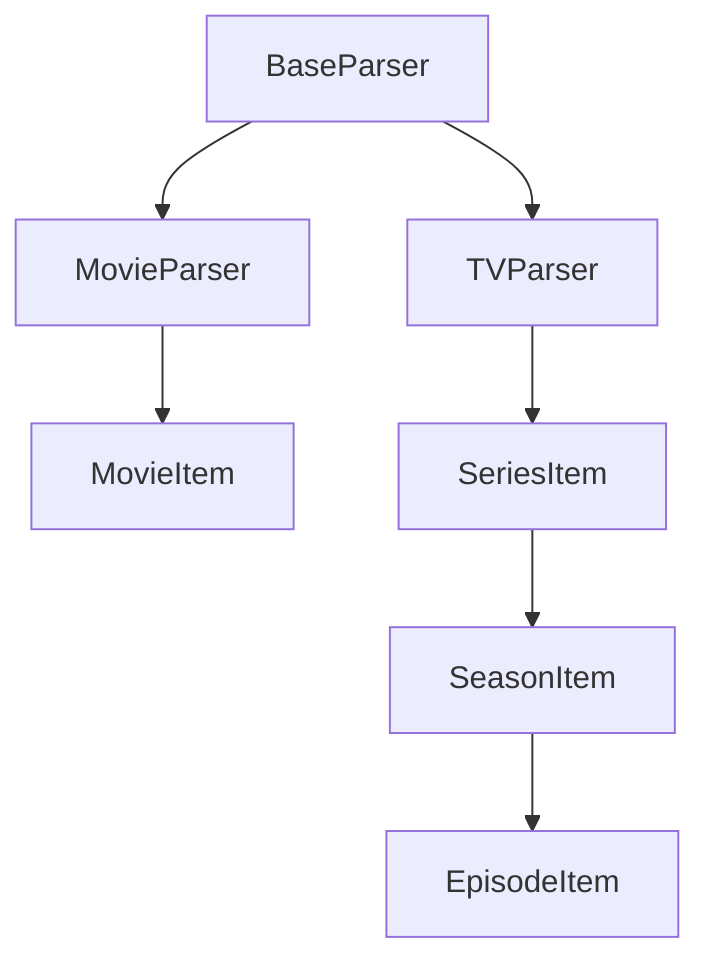

# Parsers API Reference

This reference documents the parser system responsible for extracting media information from directory structures and files.

## Parser Architecture

The parser system follows a hierarchical structure with base classes and specialized implementations:



## Base Parser

### `BaseParser`

Abstract base class providing common parsing functionality.

```python
from abc import ABC, abstractmethod
from pathlib import Path
from media_audit.parsers.base import BaseParser

class BaseParser(ABC):
    """Base class for media parsers."""
    
    def __init__(self, patterns: CompiledPatterns, cache: MediaCache | None = None):
        """Initialize parser with patterns and optional cache."""
```

#### Properties

##### `patterns`
**Type**: `CompiledPatterns`  
**Description**: Compiled regex patterns for asset matching.

##### `cache`
**Type**: `MediaCache | None`  
**Description**: Optional caching system for performance optimization.

#### Core Methods

##### `parse()`
**Abstract method** that must be implemented by subclasses.

```python
@abstractmethod
def parse(self, directory: Path) -> MediaItem | None:
    """Parse directory and return media item."""
```

##### `find_assets()`
Discovers assets (posters, backgrounds, etc.) in a directory.

```python
def find_assets(self, directory: Path) -> MediaAssets:
    """Find all assets in directory using configured patterns."""
```

**Process**:
1. Scan directory for files
2. Match files against pattern types
3. Return `MediaAssets` with categorized files

**Example**:
```python
assets = parser.find_assets(Path("/movies/The Matrix (1999)"))
print(f"Found {len(assets.posters)} posters")
print(f"Found {len(assets.backgrounds)} backgrounds")
print(f"Found {len(assets.trailers)} trailers")
```

##### `find_video_files()`
Discovers video files in a directory.

```python
def find_video_files(self, directory: Path) -> list[Path]:
    """Find video files in directory."""
```

**Supported Extensions**:
```python
VIDEO_EXTENSIONS = {
    '.mkv', '.mp4', '.avi', '.mov', '.wmv', 
    '.m4v', '.flv', '.webm', '.mpg', '.mpeg'
}
```

**Features**:
- Recursive search in subdirectories
- Case-insensitive extension matching
- Exclusion of sample files and extras

##### `extract_metadata()`
Extracts metadata from directory and file names.

```python
def extract_metadata(self, directory: Path) -> dict[str, Any]:
    """Extract metadata from directory structure."""
```

**Extracted Information**:
- Release year
- Quality indicators (1080p, 4K, etc.)
- Source information (BluRay, WEBDL, etc.)
- Release group names
- External IDs (IMDb, TMDB, etc.)

## Movie Parser

### `MovieParser`

Specialized parser for movie directories.

```python
from media_audit.parsers import MovieParser

class MovieParser(BaseParser):
    """Parser for movie directories."""
```

#### Methods

##### `parse()`
Main parsing method for movie directories.

```python
def parse(self, directory: Path) -> MovieItem | None:
    """Parse movie directory and return MovieItem."""
```

**Process**:
1. Check if directory is a valid movie directory
2. Extract movie metadata from directory name
3. Find video files and analyze primary video
4. Discover assets (posters, backgrounds, trailers)
5. Create and return `MovieItem`

**Example**:
```python
parser = MovieParser(patterns, cache)
movie = parser.parse(Path("/movies/The Matrix (1999)"))

if movie:
    print(f"Movie: {movie.name} ({movie.year})")
    print(f"Video: {movie.video_info.codec if movie.video_info else 'None'}")
    print(f"Assets: {len(movie.assets.posters)} posters")
```

##### `is_movie_directory()`
Determines if a directory contains movie content.

```python
def is_movie_directory(self, directory: Path) -> bool:
    """Check if directory represents a movie."""
```

**Detection Criteria**:
- Contains video files
- Directory name matches movie patterns
- No season/episode structure (differentiates from TV)

**Movie Name Patterns**:
```python
MOVIE_PATTERNS = [
    r'^(.+?)\s*\((\d{4})\).*$',        # Movie (Year)
    r'^(.+?)\s*\.(\d{4})\..*$',         # Movie.Year.
    r'^(.+?)\s*-\s*(\d{4}).*$',         # Movie - Year
    r'^(.+?)\s+(\d{4})\s+.*$'           # Movie Year
]
```

##### `extract_movie_info()`
Extracts movie-specific information from directory name.

```python
def extract_movie_info(self, directory: Path) -> dict[str, Any]:
    """Extract movie information from directory name."""
```

**Extracted Fields**:
- `title`: Movie title
- `year`: Release year
- `quality`: Resolution/quality (1080p, 4K, etc.)
- `source`: Source format (BluRay, WEBDL, WEBRip, etc.)
- `codec`: Video codec information
- `release_group`: Release group name

**Example Extractions**:
```python
# "The Matrix (1999) 1080p BluRay x264-GROUP"
{
    "title": "The Matrix",
    "year": 1999,
    "quality": "1080p",
    "source": "BluRay",
    "codec": "x264",
    "release_group": "GROUP"
}

# "Inception.2010.2160p.UHD.BluRay.x265-RELEASE"
{
    "title": "Inception",
    "year": 2010,
    "quality": "2160p",
    "source": "UHD BluRay",
    "codec": "x265",
    "release_group": "RELEASE"
}
```

##### `find_main_video()`
Identifies the primary video file for a movie.

```python
def find_main_video(self, directory: Path) -> Path | None:
    """Find main video file in movie directory."""
```

**Selection Logic**:
1. **Largest file** - Usually the main feature
2. **Avoid samples** - Skip files with "sample" in name
3. **Avoid extras** - Skip files in extras/special features folders
4. **Name matching** - Prefer files matching directory name

#### Usage Examples

```python
from media_audit.parsers import MovieParser
from media_audit.patterns import get_patterns

# Initialize parser
patterns = get_patterns(['plex', 'jellyfin'])
compiled_patterns = patterns.compile_patterns()
parser = MovieParser(compiled_patterns)

# Parse single movie
movie_dir = Path("/movies/The Matrix (1999)")
movie = parser.parse(movie_dir)

if movie:
    print(f"Title: {movie.name}")
    print(f"Year: {movie.year}")
    print(f"Quality: {movie.quality}")
    print(f"Source: {movie.source}")
    print(f"Video codec: {movie.video_info.codec if movie.video_info else 'Unknown'}")
    
    # Check assets
    print(f"Posters: {len(movie.assets.posters)}")
    print(f"Backgrounds: {len(movie.assets.backgrounds)}")
    print(f"Trailers: {len(movie.assets.trailers)}")
```

## TV Parser

### `TVParser`

Specialized parser for TV show directory structures.

```python
from media_audit.parsers import TVParser

class TVParser(BaseParser):
    """Parser for TV show directories."""
```

#### Methods

##### `parse()`
Main parsing method for TV series directories.

```python
def parse(self, directory: Path) -> SeriesItem | None:
    """Parse TV series directory and return SeriesItem."""
```

**Process**:
1. Validate TV show directory structure
2. Extract series metadata
3. Find series-level assets
4. Discover and parse seasons
5. For each season, discover and parse episodes
6. Create and return complete `SeriesItem` hierarchy

##### `is_tv_directory()`
Determines if a directory contains TV show content.

```python
def is_tv_directory(self, directory: Path) -> bool:
    """Check if directory represents a TV show."""
```

**Detection Criteria**:
- Contains season subdirectories
- Season directories match patterns
- Contains episode files in season structure

**Season Directory Patterns**:
```python
SEASON_PATTERNS = [
    r'^Season\s*(\d+)$',           # Season 1, Season 01
    r'^S(\d+)$',                   # S1, S01
    r'^(\d+)$',                    # 1, 01
    r'^Season\s*(\d+).*$',         # Season 1 Extras
]
```

##### `parse_series()`
Extracts series-level information.

```python
def parse_series(self, directory: Path) -> dict[str, Any]:
    """Parse series information from directory."""
```

**Extracted Information**:
- Series name and metadata
- External identifiers (IMDb, TVDB, TMDB)
- Series-level assets

##### `parse_seasons()`
Discovers and parses all seasons in a series.

```python
def parse_seasons(self, series_directory: Path) -> list[SeasonItem]:
    """Parse all seasons in series directory."""
```

**Features**:
- Automatic season number detection
- Season-specific asset discovery
- Episode parsing within each season

##### `parse_episodes()`
Discovers and parses all episodes in a season.

```python
def parse_episodes(self, season_directory: Path, season_number: int) -> list[EpisodeItem]:
    """Parse all episodes in season directory."""
```

**Episode Patterns**:
```python
EPISODE_PATTERNS = [
    r'S(\d+)E(\d+)',              # S01E01
    r'(\d+)x(\d+)',               # 1x01
    r'Season\s*(\d+).*Episode\s*(\d+)',  # Season 1 Episode 1
    r'S(\d+)\.E(\d+)',            # S01.E01
]
```

#### Advanced Features

##### `find_season_assets()`
Discovers season-specific assets.

```python
def find_season_assets(self, series_directory: Path, season_number: int) -> MediaAssets:
    """Find assets for specific season."""
```

**Season Asset Types**:
- Season posters (`Season01.jpg`, `Season 1.jpg`)
- Season banners (`Season01-banner.jpg`)
- Season backgrounds (`Season01-fanart.jpg`)

##### `extract_episode_info()`
Extracts detailed episode information.

```python
def extract_episode_info(self, episode_path: Path) -> dict[str, Any]:
    """Extract episode information from filename."""
```

**Extracted Fields**:
- Season and episode numbers
- Episode title (if present)
- Quality and source information
- Release group

**Example Extractions**:
```python
# "S01E01 - Pilot.mkv"
{
    "season": 1,
    "episode": 1,
    "title": "Pilot"
}

# "Breaking.Bad.S01E01.1080p.WEBDL.x264-GROUP.mkv"
{
    "season": 1,
    "episode": 1,
    "quality": "1080p",
    "source": "WEBDL",
    "codec": "x264",
    "release_group": "GROUP"
}
```

#### Usage Examples

```python
from media_audit.parsers import TVParser

# Initialize parser
parser = TVParser(compiled_patterns)

# Parse TV series
series_dir = Path("/tv/Breaking Bad")
series = parser.parse(series_dir)

if series:
    print(f"Series: {series.name}")
    print(f"Seasons: {len(series.seasons)}")
    print(f"Total Episodes: {series.total_episodes}")
    
    # Iterate through seasons
    for season in series.seasons:
        print(f"\nSeason {season.season_number}:")
        print(f"  Episodes: {len(season.episodes)}")
        print(f"  Assets: {len(season.assets.posters)} posters")
        
        # Show first few episodes
        for episode in season.episodes[:3]:
            episode_id = f"S{episode.season_number:02d}E{episode.episode_number:02d}"
            title = f" - {episode.episode_title}" if episode.episode_title else ""
            print(f"    {episode_id}{title}")
```

## Pattern Matching System

### Asset Discovery

Both parsers use the pattern matching system for asset discovery:

```python
def find_assets(self, directory: Path) -> MediaAssets:
    """Find assets using compiled patterns."""
    assets = MediaAssets()
    
    for file_path in directory.iterdir():
        if not file_path.is_file():
            continue
            
        filename = file_path.name
        
        # Check each pattern type
        for pattern in self.patterns.poster_re:
            if pattern.search(filename):
                assets.posters.append(file_path)
                break
        
        for pattern in self.patterns.background_re:
            if pattern.search(filename):
                assets.backgrounds.append(file_path)
                break
        
        # ... similar for other asset types
    
    return assets
```

### Custom Pattern Integration

Parsers support custom patterns through configuration:

```python
# Custom patterns example
custom_patterns = MediaPatterns(
    poster_patterns=[
        r"^poster\.",
        r"^movie-poster\.",
        r"^custom-cover\."
    ],
    background_patterns=[
        r"^fanart\.",
        r"^movie-bg\.",
        r"^wallpaper\."
    ]
)

compiled = custom_patterns.compile_patterns()
parser = MovieParser(compiled)
```

## Caching Integration

### Cache Usage

Parsers integrate with the caching system for improved performance:

```python
def parse(self, directory: Path) -> MovieItem | None:
    """Parse directory with caching support."""
    
    # Check cache first
    if self.cache:
        cached_data = self.cache.get_media_item(directory, "movie")
        if cached_data:
            return self.deserialize_movie(cached_data)
    
    # Parse directory
    movie = self._parse_directory(directory)
    
    # Cache result
    if self.cache and movie:
        self.cache.set_media_item(directory, "movie", self.serialize_movie(movie))
    
    return movie
```

### Cache Serialization

```python
def serialize_movie(self, movie: MovieItem) -> dict[str, Any]:
    """Serialize movie for caching."""
    return {
        "name": movie.name,
        "year": movie.year,
        "path": str(movie.path),
        "assets": {
            "posters": [str(p) for p in movie.assets.posters],
            "backgrounds": [str(p) for p in movie.assets.backgrounds],
            "trailers": [str(p) for p in movie.assets.trailers]
        },
        "metadata": movie.metadata
    }

def deserialize_movie(self, data: dict[str, Any]) -> MovieItem:
    """Deserialize cached movie data."""
    assets = MediaAssets(
        posters=[Path(p) for p in data["assets"]["posters"]],
        backgrounds=[Path(p) for p in data["assets"]["backgrounds"]],
        trailers=[Path(p) for p in data["assets"]["trailers"]]
    )
    
    return MovieItem(
        path=Path(data["path"]),
        name=data["name"],
        year=data["year"],
        assets=assets,
        metadata=data["metadata"]
    )
```

## Custom Parser Implementation

### Extending Base Parser

```python
from media_audit.parsers.base import BaseParser
from media_audit.models import MediaItem, MediaType

class AnimeParser(BaseParser):
    """Custom parser for anime content."""
    
    def parse(self, directory: Path) -> MediaItem | None:
        """Parse anime directory."""
        if not self.is_anime_directory(directory):
            return None
        
        # Extract anime-specific information
        anime_info = self.extract_anime_info(directory)
        
        # Find assets
        assets = self.find_assets(directory)
        
        # Find video files
        video_files = self.find_video_files(directory)
        main_video = video_files[0] if video_files else None
        
        # Create anime item (using MovieItem as base)
        anime = MovieItem(
            path=directory,
            name=anime_info.get("title", directory.name),
            year=anime_info.get("year"),
            assets=assets,
            metadata={
                "type": "anime",
                "season": anime_info.get("season"),
                "studio": anime_info.get("studio"),
                "mal_id": anime_info.get("mal_id")  # MyAnimeList ID
            }
        )
        
        # Set video info if available
        if main_video:
            from media_audit.probe import probe_video
            anime.video_info = probe_video(main_video, cache=self.cache)
        
        return anime
    
    def is_anime_directory(self, directory: Path) -> bool:
        """Check if directory contains anime."""
        # Custom logic for anime detection
        name = directory.name.lower()
        
        # Check for anime indicators
        anime_indicators = ["[", "]", "episode", "ep", "ova", "ona", "movie"]
        has_indicators = any(indicator in name for indicator in anime_indicators)
        
        # Check for video files
        has_videos = bool(self.find_video_files(directory))
        
        return has_indicators and has_videos
    
    def extract_anime_info(self, directory: Path) -> dict[str, Any]:
        """Extract anime-specific information."""
        name = directory.name
        info = {}
        
        # Extract title and year
        import re
        
        # Pattern: [Studio] Title (Year) [Quality]
        pattern = r'\[([^\]]+)\]\s*(.+?)\s*\((\d{4})\)\s*\[([^\]]+)\]'
        match = re.search(pattern, name)
        
        if match:
            info["studio"] = match.group(1)
            info["title"] = match.group(2).strip()
            info["year"] = int(match.group(3))
            info["quality"] = match.group(4)
        else:
            # Fallback extraction
            year_match = re.search(r'\((\d{4})\)', name)
            if year_match:
                info["year"] = int(year_match.group(1))
                info["title"] = name.replace(year_match.group(0), "").strip()
        
        return info

# Usage
anime_parser = AnimeParser(compiled_patterns, cache)
anime = anime_parser.parse(Path("/anime/[Studio] Attack on Titan (2013) [1080p]"))
```

### Multi-Format Parser

```python
class UniversalParser(BaseParser):
    """Parser that handles multiple content types."""
    
    def __init__(self, patterns: CompiledPatterns, cache: MediaCache | None = None):
        super().__init__(patterns, cache)
        self.movie_parser = MovieParser(patterns, cache)
        self.tv_parser = TVParser(patterns, cache)
    
    def parse(self, directory: Path) -> MediaItem | None:
        """Parse directory, auto-detecting content type."""
        
        # Try TV parser first (more specific structure)
        if self.tv_parser.is_tv_directory(directory):
            return self.tv_parser.parse(directory)
        
        # Try movie parser
        if self.movie_parser.is_movie_directory(directory):
            return self.movie_parser.parse(directory)
        
        # Custom detection logic for other types
        if self.is_anime_directory(directory):
            return self.parse_as_anime(directory)
        
        if self.is_documentary_directory(directory):
            return self.parse_as_documentary(directory)
        
        return None
    
    def detect_content_type(self, directory: Path) -> str | None:
        """Detect content type of directory."""
        if self.tv_parser.is_tv_directory(directory):
            return "tv"
        elif self.movie_parser.is_movie_directory(directory):
            return "movie"
        elif self.is_anime_directory(directory):
            return "anime"
        elif self.is_documentary_directory(directory):
            return "documentary"
        else:
            return None
```

## Error Handling

### Parser Exceptions

```python
class ParserError(Exception):
    """Base exception for parser errors."""
    pass

class InvalidDirectoryError(ParserError):
    """Directory is not valid media content."""
    pass

class MetadataExtractionError(ParserError):
    """Failed to extract metadata from directory."""
    pass

# Usage in parsers
def parse(self, directory: Path) -> MediaItem | None:
    """Parse with error handling."""
    try:
        if not directory.exists():
            raise InvalidDirectoryError(f"Directory does not exist: {directory}")
        
        if not self.is_movie_directory(directory):
            return None  # Not an error, just not this type
        
        movie_info = self.extract_movie_info(directory)
        if not movie_info.get("title"):
            raise MetadataExtractionError(f"Could not extract title from: {directory.name}")
        
        # Continue parsing...
        
    except ParserError as e:
        self.logger.warning(f"Parser error: {e}")
        return None
    except Exception as e:
        self.logger.error(f"Unexpected error parsing {directory}: {e}")
        return None
```

### Graceful Degradation

```python
def find_assets_safe(self, directory: Path) -> MediaAssets:
    """Find assets with error handling."""
    assets = MediaAssets()
    
    try:
        for file_path in directory.iterdir():
            try:
                if file_path.is_file():
                    self.categorize_asset(file_path, assets)
            except OSError as e:
                # Skip files that can't be accessed
                self.logger.warning(f"Skipping inaccessible file: {file_path}")
                continue
    except OSError as e:
        # Directory not accessible
        self.logger.error(f"Cannot access directory: {directory}")
    
    return assets
```

## Best Practices

### Parser Design

1. **Single Responsibility**: Each parser handles one content type
2. **Error Handling**: Graceful degradation with informative logging
3. **Performance**: Use caching for expensive operations
4. **Extensibility**: Design for easy subclassing and customization

### Pattern Usage

1. **Specificity**: Use specific patterns for better accuracy
2. **Performance**: Order patterns by frequency for faster matching
3. **Flexibility**: Support multiple naming conventions
4. **Testing**: Validate patterns against real-world data

### Metadata Extraction

1. **Robustness**: Handle various naming conventions
2. **Validation**: Validate extracted data
3. **Fallbacks**: Provide sensible defaults
4. **Encoding**: Handle international characters properly

### Cache Integration

1. **Invalidation**: Properly invalidate cache when data changes
2. **Serialization**: Use efficient serialization formats
3. **Versioning**: Handle schema changes gracefully
4. **Performance**: Balance cache hit rate with storage usage