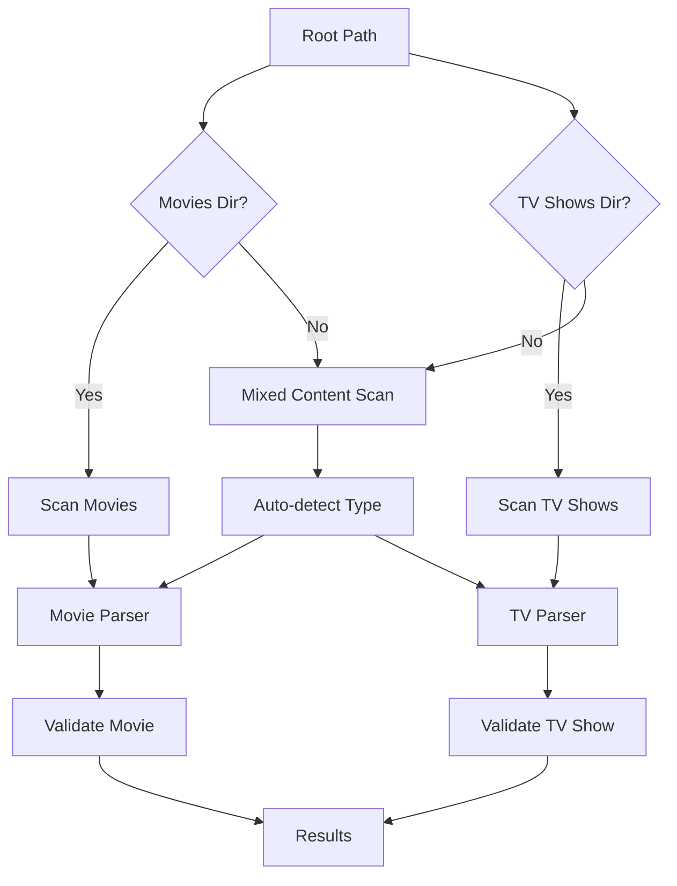

# Scanner API Reference

This reference documents the scanner system responsible for discovering and processing media content.

## Core Scanner Classes

### `MediaScanner`

The main scanner class that orchestrates the entire scanning process.

```python
from media_audit.scanner import MediaScanner
from media_audit.config import ScanConfig
from pathlib import Path

class MediaScanner:
    """Scans media libraries and validates content."""
    
    def __init__(self, config: ScanConfig):
        """Initialize scanner with configuration."""
```

#### Initialization

```python
# Create scanner with configuration
config = ScanConfig(
    root_paths=[Path("/media/movies"), Path("/media/tv")],
    concurrent_workers=8,
    cache_enabled=True
)
scanner = MediaScanner(config)
```

#### Properties

##### `config`
**Type**: `ScanConfig`  
**Description**: Scanner configuration settings.

##### `cache`
**Type**: `MediaCache`  
**Description**: Caching system for performance optimization.

##### `movie_parser`
**Type**: `MovieParser`  
**Description**: Parser for movie directories.

##### `tv_parser`
**Type**: `TVParser`  
**Description**: Parser for TV show directories.

##### `validator`
**Type**: `MediaValidator`  
**Description**: Validation system for media items.

### Primary Methods

#### `scan()`

Performs complete scan of all configured root paths.

```python
def scan(self) -> ScanResult:
    """Scan all configured root paths."""
```

**Returns**: `ScanResult` containing all discovered media items and statistics.

**Features**:
- Concurrent processing with configurable workers
- Progress reporting with interactive indicators
- Keyboard interrupt handling (ESC to cancel)
- Automatic cache management
- Error collection and reporting

**Example**:
```python
result = scanner.scan()
print(f"Found {result.total_items} items with {result.total_issues} issues")
print(f"Scan completed in {result.duration:.2f} seconds")
```

#### `is_cancelled()`

Check if scan has been cancelled by user input.

```python
def is_cancelled(self) -> bool:
    """Check if scan has been cancelled."""
```

**Returns**: `bool` indicating cancellation status.

## Scanning Process

### Directory Discovery

The scanner follows a structured approach to media discovery:



### Supported Directory Structures

#### Standard Structure
```
Root/
├── Movies/
│   ├── Movie 1 (2020)/
│   └── Movie 2 (2021)/
└── TV Shows/  # or "TV" or "Series"
    ├── Series 1/
    └── Series 2/
```

#### Mixed Structure
```
Root/
├── Movie 1 (2020)/
├── Movie 2 (2021)/
├── Series 1/
└── Series 2/
```

### Processing Methods

#### `_scan_path()`

Scan a single root path for media content.

```python
def _scan_path(self, path: Path, result: ScanResult, progress: Progress | None = None) -> None:
    """Scan a single path for media content."""
```

**Parameters**:
- `path`: Root path to scan
- `result`: Results container to populate
- `progress`: Optional progress reporter

#### `_scan_movies()`

Scan a movies directory with concurrent processing.

```python
def _scan_movies(
    self,
    movies_dir: Path,
    result: ScanResult,
    progress: Progress | None = None,
    force_type: str | None = None,
) -> None:
    """Scan a movies directory."""
```

**Parameters**:
- `movies_dir`: Directory containing movie folders
- `result`: Results container to populate  
- `progress`: Optional progress reporter
- `force_type`: Force content type detection

**Features**:
- Concurrent processing with ThreadPoolExecutor
- Progress tracking per movie
- Error handling and collection
- Cancellation support

#### `_scan_tv_shows()`

Scan a TV shows directory with concurrent processing.

```python
def _scan_tv_shows(
    self,
    tv_dir: Path,
    result: ScanResult,
    progress: Progress | None = None,
    force_type: str | None = None,
) -> None:
    """Scan a TV shows directory."""
```

**Parameters**:
- `tv_dir`: Directory containing TV show folders
- `result`: Results container to populate
- `progress`: Optional progress reporter
- `force_type`: Force content type detection

#### `_scan_mixed_content()`

Scan directories with mixed movies and TV shows.

```python
def _scan_mixed_content(
    self, path: Path, result: ScanResult, progress: Progress | None = None
) -> None:
    """Scan a directory that might contain both movies and TV shows."""
```

**Features**:
- Automatic content type detection
- TV show detection prioritized (more specific structure)
- Fallback to movie detection

#### `_process_movie()`

Process a single movie directory.

```python
def _process_movie(self, directory: Path) -> MovieItem | None:
    """Process a single movie directory."""
```

**Process**:
1. Parse directory with `MovieParser`
2. Validate with `MediaValidator`
3. Return processed `MovieItem`

#### `_process_series()`

Process a single TV series directory.

```python
def _process_series(self, directory: Path) -> SeriesItem | None:
    """Process a single TV series directory."""
```

**Process**:
1. Parse directory with `TVParser`
2. Validate with `MediaValidator`
3. Return processed `SeriesItem`

## Progress Reporting

### Interactive Progress

The scanner provides real-time progress reporting:

```python
from rich.progress import Progress, SpinnerColumn, TextColumn

with Progress(
    SpinnerColumn(),
    TextColumn("[progress.description]{task.description}"),
    console=console,
) as progress:
    task = progress.add_task("Discovering media files...", total=None)
    # ... scanning logic
```

### Progress Phases

1. **Discovery Phase**: Finding media directories
2. **Movies Phase**: Processing movie directories
3. **TV Shows Phase**: Processing TV series directories
4. **Mixed Content Phase**: Processing mixed directories

### User Interaction

#### Cancellation Support

Users can cancel scans using:
- **ESC Key**: Graceful cancellation
- **Ctrl+C**: Emergency termination

```python
def _check_for_esc(self) -> None:
    """Monitor for ESC key press on Windows."""
    if sys.platform == "win32":
        import msvcrt
        
        while not self._cancelled:
            if msvcrt.kbhit():
                key = msvcrt.getch()
                if key == b"\x1b":  # ESC key
                    with self._cancel_lock:
                        self._cancelled = True
                        self.console.print(
                            "\n[yellow]Scan cancelled by user (ESC pressed)[/yellow]"
                        )
                    break
            time.sleep(0.1)
```

## Concurrent Processing

### Thread Pool Execution

The scanner uses `ThreadPoolExecutor` for concurrent processing:

```python
if self.config.concurrent_workers > 1:
    with concurrent.futures.ThreadPoolExecutor(
        max_workers=self.config.concurrent_workers
    ) as executor:
        futures = {}
        for movie_dir in movie_dirs:
            if self.is_cancelled():
                break
            future = executor.submit(self._process_movie, movie_dir)
            futures[future] = movie_dir

        for future in concurrent.futures.as_completed(futures):
            if self.is_cancelled():
                executor.shutdown(wait=False, cancel_futures=True)
                break
            # Process results...
```

### Worker Configuration

**Guidelines**:
- **Default**: 4 workers
- **CPU-bound**: CPU cores × 1.5
- **I/O-bound**: CPU cores × 2-3
- **Network storage**: Reduce workers to minimize load

**Performance Impact**:
```python
# Conservative (network storage)
config = ScanConfig(concurrent_workers=2)

# Balanced (local storage)
config = ScanConfig(concurrent_workers=4)

# Aggressive (SSD + high CPU)
config = ScanConfig(concurrent_workers=16)
```

## Error Handling

### Error Collection

Errors are collected during scanning and included in results:

```python
try:
    movie = self._process_movie(movie_dir)
    if movie:
        result.movies.append(movie)
except Exception as e:
    result.errors.append(f"Error processing movie: {e}")
```

### Error Types

#### Path Errors
```python
if not root_path.exists():
    result.errors.append(f"Root path does not exist: {root_path}")
    continue
```

#### Permission Errors
```python
try:
    for item in directory.iterdir():
        # Process item
except PermissionError:
    result.errors.append(f"Permission denied: {directory}")
```

#### Processing Errors
```python
except Exception as e:
    result.errors.append(f"Error processing {item_path}: {e}")
```

### Graceful Degradation

The scanner continues processing even when encountering errors:

- **Skip inaccessible directories**
- **Log errors for review**
- **Continue with remaining items**
- **Provide partial results**

## Cache Integration

### Cache Usage

The scanner integrates with the caching system for performance:

```python
# Initialize cache
self.cache = MediaCache(
    cache_dir=config.cache_dir, 
    enabled=config.cache_enabled
)

# Cache integration in parsers
self.movie_parser = MovieParser(patterns, cache=self.cache)
self.tv_parser = TVParser(patterns, cache=self.cache)

# Cache integration in validator
self.validator = MediaValidator(config, cache=self.cache)
```

### Cache Statistics

After scanning, cache statistics are displayed:

```python
if self.cache.enabled:
    stats = self.cache.get_stats()
    if stats["total"] > 0:
        self.console.print(
            f"\n[dim]Cache: {stats['hits']} hits, {stats['misses']} misses "
            f"({stats['hit_rate']:.1f}% hit rate)[/dim]"
        )
```

## Custom Scanner Implementation

### Extending MediaScanner

```python
from media_audit.scanner import MediaScanner

class CustomScanner(MediaScanner):
    """Custom scanner with additional functionality."""
    
    def __init__(self, config: ScanConfig, custom_options: dict = None):
        super().__init__(config)
        self.custom_options = custom_options or {}
    
    def scan(self) -> ScanResult:
        """Enhanced scan with custom processing."""
        # Pre-scan hook
        self.pre_scan_hook()
        
        # Run standard scan
        result = super().scan()
        
        # Post-scan hook
        self.post_scan_hook(result)
        
        return result
    
    def pre_scan_hook(self):
        """Called before scanning starts."""
        print("Starting custom scan...")
    
    def post_scan_hook(self, result: ScanResult):
        """Called after scanning completes."""
        print(f"Custom scan completed: {result.total_items} items")
        
        # Custom analysis
        self.analyze_results(result)
    
    def analyze_results(self, result: ScanResult):
        """Perform custom analysis on results."""
        # Example: Find duplicate movies
        movie_names = {}
        for movie in result.movies:
            name = movie.name.lower()
            if name in movie_names:
                print(f"Potential duplicate: {movie.name}")
            else:
                movie_names[name] = movie

# Usage
custom_scanner = CustomScanner(config, {"analyze_duplicates": True})
result = custom_scanner.scan()
```

### Specialized Scanners

#### Movie-Only Scanner

```python
class MovieScanner(MediaScanner):
    """Scanner specialized for movie libraries."""
    
    def _scan_path(self, path: Path, result: ScanResult, progress=None):
        """Only scan for movies."""
        # Look for Movies directory or treat root as movies
        movies_dir = path / "Movies" if (path / "Movies").exists() else path
        
        if movies_dir.exists():
            self._scan_movies(movies_dir, result, progress)
```

#### TV Scanner

```python
class TVScanner(MediaScanner):
    """Scanner specialized for TV libraries."""
    
    def _scan_path(self, path: Path, result: ScanResult, progress=None):
        """Only scan for TV shows."""
        # Look for TV directories
        for tv_name in ["TV Shows", "TV", "Series"]:
            tv_dir = path / tv_name
            if tv_dir.exists():
                self._scan_tv_shows(tv_dir, result, progress)
                break
        else:
            # Treat root as TV directory
            self._scan_tv_shows(path, result, progress)
```

## Integration Patterns

### Event-Driven Scanning

```python
from typing import Callable
from dataclasses import dataclass

@dataclass
class ScanEvent:
    event_type: str
    data: dict

class EventDrivenScanner(MediaScanner):
    """Scanner with event callbacks."""
    
    def __init__(self, config: ScanConfig):
        super().__init__(config)
        self.callbacks: dict[str, list[Callable]] = {}
    
    def on(self, event_type: str, callback: Callable):
        """Register event callback."""
        if event_type not in self.callbacks:
            self.callbacks[event_type] = []
        self.callbacks[event_type].append(callback)
    
    def emit(self, event_type: str, data: dict = None):
        """Emit event to registered callbacks."""
        event = ScanEvent(event_type, data or {})
        for callback in self.callbacks.get(event_type, []):
            callback(event)
    
    def _process_movie(self, directory: Path) -> MovieItem | None:
        """Enhanced movie processing with events."""
        self.emit("movie_start", {"path": str(directory)})
        
        movie = super()._process_movie(directory)
        
        if movie:
            self.emit("movie_complete", {"movie": movie})
            
            if movie.has_issues:
                self.emit("movie_issues", {"movie": movie, "issues": movie.issues})
        
        return movie

# Usage
scanner = EventDrivenScanner(config)

@scanner.on("movie_issues")
def handle_movie_issues(event):
    movie = event.data["movie"]
    print(f"Found issues in {movie.name}")

result = scanner.scan()
```

### Batch Processing

```python
class BatchScanner:
    """Scanner that processes items in batches."""
    
    def __init__(self, scanner: MediaScanner, batch_size: int = 100):
        self.scanner = scanner
        self.batch_size = batch_size
    
    def scan_in_batches(self) -> Iterator[ScanResult]:
        """Scan and yield results in batches."""
        all_dirs = self.discover_all_directories()
        
        for i in range(0, len(all_dirs), self.batch_size):
            batch_dirs = all_dirs[i:i + self.batch_size]
            batch_result = self.process_batch(batch_dirs)
            yield batch_result
    
    def discover_all_directories(self) -> list[Path]:
        """Discover all media directories."""
        directories = []
        
        for root_path in self.scanner.config.root_paths:
            for item in root_path.rglob("*"):
                if item.is_dir() and self.is_media_directory(item):
                    directories.append(item)
        
        return directories
    
    def is_media_directory(self, path: Path) -> bool:
        """Check if directory contains media."""
        # Check for video files
        video_extensions = {".mkv", ".mp4", ".avi", ".mov"}
        for file in path.iterdir():
            if file.suffix.lower() in video_extensions:
                return True
        return False

# Usage
batch_scanner = BatchScanner(scanner, batch_size=50)

for batch_result in batch_scanner.scan_in_batches():
    print(f"Processed batch: {batch_result.total_items} items")
    # Process batch results...
```

## Performance Optimization

### Memory Management

```python
class MemoryEfficientScanner(MediaScanner):
    """Scanner optimized for low memory usage."""
    
    def scan(self) -> ScanResult:
        """Memory-efficient scanning."""
        import gc
        
        # Initial scan
        result = ScanResult(
            scan_time=datetime.now(),
            duration=0,
            root_paths=self.config.root_paths
        )
        
        # Process in smaller batches
        for root_path in self.config.root_paths:
            self.scan_path_efficiently(root_path, result)
            
            # Force garbage collection between paths
            gc.collect()
        
        result.duration = time.time() - start_time
        return result
    
    def scan_path_efficiently(self, path: Path, result: ScanResult):
        """Memory-efficient path scanning."""
        # Process movies in smaller batches
        movies_dir = path / "Movies"
        if movies_dir.exists():
            movie_dirs = list(movies_dir.iterdir())
            
            # Process in chunks to limit memory usage
            chunk_size = 20
            for i in range(0, len(movie_dirs), chunk_size):
                chunk = movie_dirs[i:i + chunk_size]
                self.process_movie_chunk(chunk, result)
                
                # Clear references and force GC
                del chunk
                gc.collect()
```

### Parallel Processing

```python
import multiprocessing as mp
from concurrent.futures import ProcessPoolExecutor

class ParallelScanner:
    """Scanner using process-based parallelism."""
    
    def __init__(self, config: ScanConfig):
        self.config = config
        self.process_count = min(mp.cpu_count(), config.concurrent_workers)
    
    def scan_parallel(self) -> ScanResult:
        """Scan using multiple processes."""
        all_dirs = self.discover_directories()
        
        # Split work among processes
        chunk_size = len(all_dirs) // self.process_count
        chunks = [
            all_dirs[i:i + chunk_size] 
            for i in range(0, len(all_dirs), chunk_size)
        ]
        
        # Process chunks in parallel
        with ProcessPoolExecutor(max_workers=self.process_count) as executor:
            futures = [
                executor.submit(process_directory_chunk, chunk, self.config)
                for chunk in chunks
            ]
            
            # Combine results
            combined_result = ScanResult(
                scan_time=datetime.now(),
                duration=0,
                root_paths=self.config.root_paths
            )
            
            for future in concurrent.futures.as_completed(futures):
                chunk_result = future.result()
                combined_result.movies.extend(chunk_result.movies)
                combined_result.series.extend(chunk_result.series)
                combined_result.errors.extend(chunk_result.errors)
            
            combined_result.update_stats()
            return combined_result

def process_directory_chunk(directories: list[Path], config: ScanConfig) -> ScanResult:
    """Process a chunk of directories in separate process."""
    scanner = MediaScanner(config)
    # ... process directories
    return result
```

## Best Practices

### Scanner Configuration

1. **Worker Count**: Adjust based on storage type and CPU cores
2. **Cache Settings**: Enable caching for repeated scans
3. **Pattern Selection**: Use specific patterns for better performance
4. **Path Organization**: Organize media in standard directory structures

### Error Handling

1. **Graceful Degradation**: Continue processing despite errors
2. **Error Logging**: Collect and log all errors for review
3. **User Communication**: Provide clear error messages
4. **Recovery Options**: Suggest fixes for common issues

### Performance

1. **Concurrent Processing**: Use appropriate worker counts
2. **Memory Management**: Clear large objects when done
3. **Cache Utilization**: Leverage caching for repeated operations
4. **Progress Reporting**: Provide user feedback for long operations

### Extensibility

1. **Event System**: Use events for custom processing
2. **Inheritance**: Extend base classes for specialized functionality
3. **Configuration**: Make behavior configurable
4. **Plugin Architecture**: Design for third-party extensions