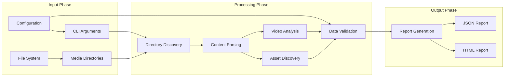
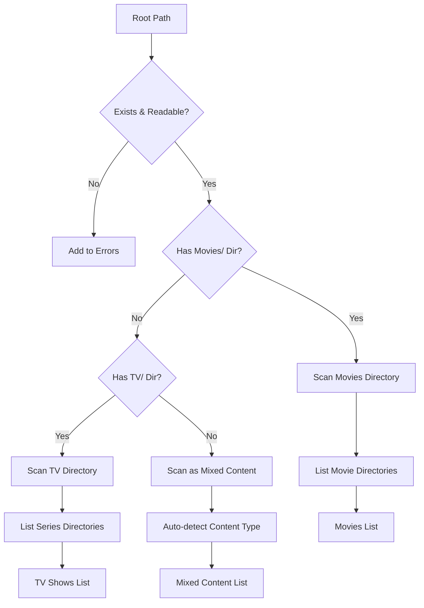
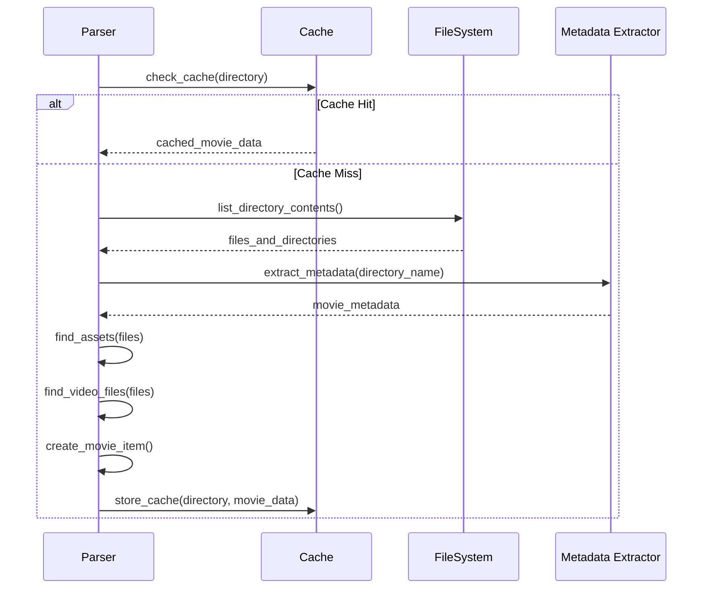
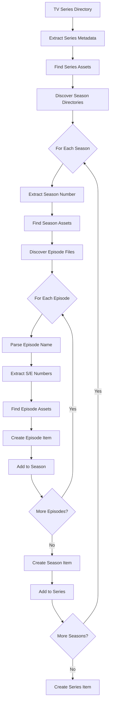
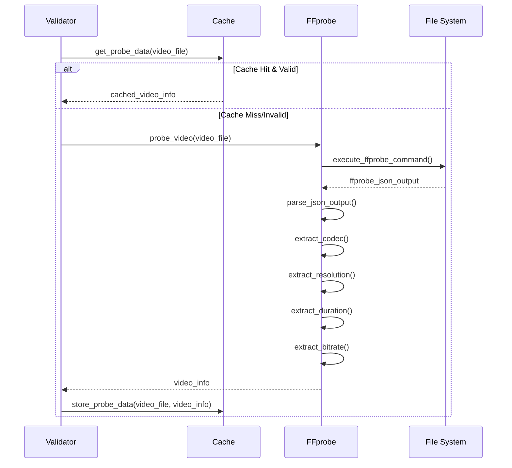
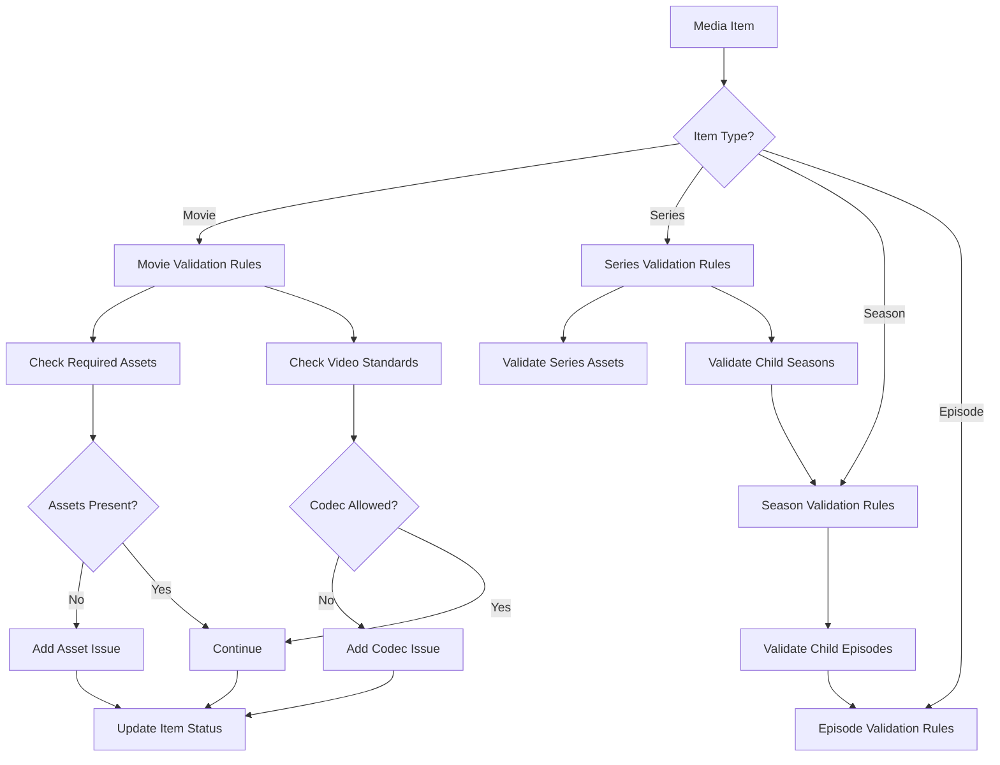
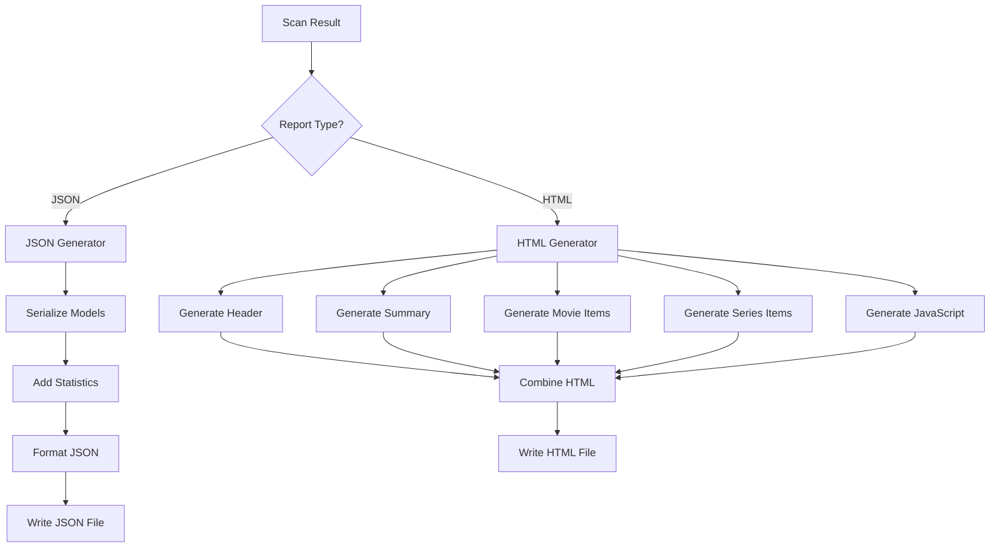
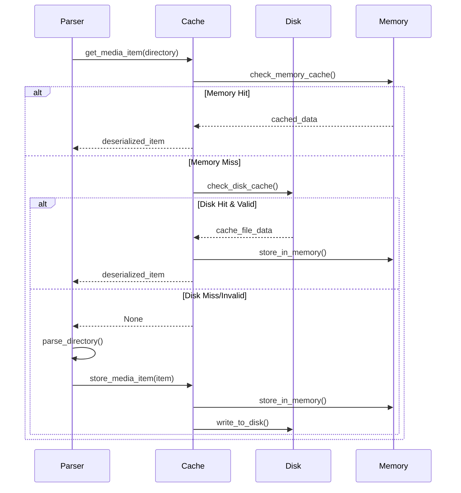
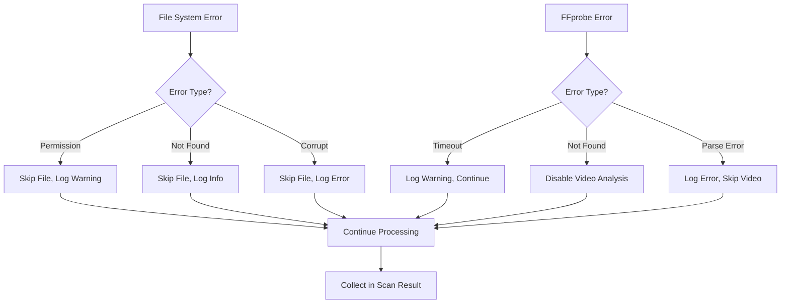

# Data Flow Documentation

This document describes the flow of data through the Media Audit system, from initial configuration to final report generation.

## Overview

Media Audit processes data through several distinct phases, each transforming and enriching the information:



## Phase-by-Phase Data Flow

### 1. Configuration Phase

**Input Sources**:
- YAML configuration files
- Command-line arguments
- Environment variables
- Built-in defaults

**Data Transformation**:
```python
# Raw configuration data
config_data = {
    "scan": {
        "root_paths": ["/media/movies", "/media/tv"],
        "profiles": ["plex"],
        "allowed_codecs": ["hevc", "av1"]
    }
}

# Transformed to typed objects
config = Config.from_dict(config_data)
# config.scan.root_paths: list[Path]
# config.scan.allowed_codecs: list[CodecType]
```

**Processing Steps**:
1. **Load Configuration**: Read from file or use defaults
2. **Environment Expansion**: Replace `${VAR}` with environment values
3. **Type Conversion**: Convert strings to appropriate types (Path, Enum, etc.)
4. **Validation**: Ensure all values are valid and consistent
5. **Merging**: Override with command-line arguments

**Output**: Fully validated `Config` object with type-safe access to all settings.

---

### 2. Directory Discovery Phase

**Input**: List of root paths from configuration

**Data Transformation**:
```python
# Input: Configuration root paths
root_paths = [Path("/media"), Path("/backup")]

# Output: Categorized directory lists  
discovered_directories = {
    "movies": [Path("/media/Movies/Movie1"), Path("/media/Movies/Movie2")],
    "tv_shows": [Path("/media/TV/Series1"), Path("/media/TV/Series2")],
    "mixed": [Path("/backup/MixedContent")]
}
```

**Processing Steps**:
1. **Path Validation**: Verify paths exist and are accessible
2. **Structure Detection**: Look for standard directory layouts
3. **Content Classification**: Categorize as Movies/, TV Shows/, or mixed
4. **Directory Enumeration**: List all media directories within each category
5. **Permission Checking**: Ensure directories are readable

**Flow Diagram**:


---

### 3. Content Parsing Phase

**Input**: Directory paths categorized by content type

**Data Transformation**:
```python
# Input: Directory path
directory = Path("/media/Movies/The Matrix (1999)")

# Output: Structured media item
movie = MovieItem(
    path=directory,
    name="The Matrix",
    year=1999,
    type=MediaType.MOVIE,
    assets=MediaAssets(
        posters=[Path("poster.jpg")],
        backgrounds=[Path("fanart.jpg")],
        trailers=[Path("trailer.mp4")]
    ),
    video_info=VideoInfo(
        path=Path("The Matrix (1999).mkv"),
        codec=None,  # Will be filled by video analysis
        size=5600000000
    )
)
```

**Processing Steps**:

#### Movie Parsing Flow


#### TV Show Parsing Flow


**Metadata Extraction**:
```python
def extract_movie_info(directory_name: str) -> dict:
    """Extract metadata from directory name."""
    # Input: "The Matrix (1999) 1080p BluRay x264-GROUP"
    
    patterns = [
        r'^(.+?)\s*\((\d{4})\)\s*(.*?)(?:\s+(\w+(?:-\w+)*))?\s*$'
    ]
    
    for pattern in patterns:
        match = re.match(pattern, directory_name)
        if match:
            return {
                "title": match.group(1).strip(),
                "year": int(match.group(2)),
                "quality_source": match.group(3),
                "release_group": match.group(4)
            }
    
    # Output: Structured metadata dictionary
```

---

### 4. Asset Discovery Phase

**Input**: Directory contents and compiled patterns

**Data Transformation**:
```python
# Input: Files in directory
files = [
    Path("poster.jpg"),
    Path("fanart.jpg"), 
    Path("banner.png"),
    Path("movie.mkv"),
    Path("trailer.mp4")
]

# Output: Categorized assets
assets = MediaAssets(
    posters=[Path("poster.jpg")],
    backgrounds=[Path("fanart.jpg")],
    banners=[Path("banner.png")],
    trailers=[Path("trailer.mp4")],
    title_cards=[]
)
```

**Pattern Matching Process**:
```python
def find_assets(self, directory: Path) -> MediaAssets:
    """Asset discovery with pattern matching."""
    assets = MediaAssets()
    
    for file_path in directory.iterdir():
        if not file_path.is_file():
            continue
            
        filename = file_path.name.lower()
        
        # Priority-based matching (first match wins)
        matched = False
        
        # Check poster patterns
        for pattern in self.patterns.poster_re:
            if pattern.search(filename):
                assets.posters.append(file_path)
                matched = True
                break
        
        if matched:
            continue
            
        # Check background patterns
        for pattern in self.patterns.background_re:
            if pattern.search(filename):
                assets.backgrounds.append(file_path)
                matched = True
                break
        
        # Continue for other asset types...
    
    return assets
```

**Pattern Priority Order**:
1. **Posters**: `poster.jpg` → `folder.jpg` → `movie.jpg` → numbered variants
2. **Backgrounds**: `fanart.jpg` → `backdrop.jpg` → `background.jpg` → numbered variants  
3. **Banners**: `banner.jpg` → numbered variants
4. **Trailers**: Files with "trailer" in name → `Trailers/` directory contents
5. **Title Cards**: Episode-matching patterns (`S01E01.jpg`)

---

### 5. Video Analysis Phase

**Input**: Video file paths from parsed media items

**Data Transformation**:
```python
# Input: Video file path
video_path = Path("/media/Movies/Movie/movie.mkv")

# Output: Detailed video information
video_info = VideoInfo(
    path=video_path,
    codec=CodecType.HEVC,
    resolution=(1920, 1080),
    duration=7260.5,  # seconds
    bitrate=8500000,  # bits per second
    size=5600000000,  # bytes
    raw_info={
        "streams": [...],  # Full FFprobe output
        "format": {...}
    }
)
```

**FFprobe Integration Flow**:


**Data Extraction Process**:
```python
def probe_video(file_path: Path) -> VideoInfo:
    """Extract video information using FFprobe."""
    
    # 1. Execute FFprobe
    cmd = ['ffprobe', '-v', 'quiet', '-print_format', 'json', 
           '-show_format', '-show_streams', str(file_path)]
    
    result = subprocess.run(cmd, capture_output=True, text=True, timeout=60)
    ffprobe_data = json.loads(result.stdout)
    
    # 2. Extract video stream information
    video_streams = [s for s in ffprobe_data['streams'] if s.get('codec_type') == 'video']
    primary_stream = video_streams[0] if video_streams else {}
    
    # 3. Map codec names
    codec_name = primary_stream.get('codec_name', '').lower()
    codec = CODEC_MAPPING.get(codec_name, CodecType.OTHER)
    
    # 4. Extract other properties
    resolution = None
    if 'width' in primary_stream and 'height' in primary_stream:
        resolution = (int(primary_stream['width']), int(primary_stream['height']))
    
    # 5. Create VideoInfo object
    return VideoInfo(
        path=file_path,
        codec=codec,
        resolution=resolution,
        duration=float(ffprobe_data.get('format', {}).get('duration', 0)),
        bitrate=int(ffprobe_data.get('format', {}).get('bit_rate', 0)),
        size=file_path.stat().st_size,
        raw_info=ffprobe_data
    )
```

---

### 6. Validation Phase

**Input**: Parsed media items with asset and video information

**Data Transformation**:
```python
# Input: Media item with parsed data
movie = MovieItem(
    name="The Matrix",
    assets=MediaAssets(posters=[], backgrounds=[Path("fanart.jpg")]),
    video_info=VideoInfo(codec=CodecType.H264)
)

# Output: Media item with validation issues
movie.issues = [
    ValidationIssue(
        category="assets",
        message="Missing poster image", 
        severity=ValidationStatus.ERROR,
        details={"expected": ["poster.jpg", "folder.jpg"]}
    ),
    ValidationIssue(
        category="encoding",
        message="Video uses non-preferred codec: h264",
        severity=ValidationStatus.WARNING,
        details={"codec": "h264", "allowed": ["hevc", "av1"]}
    )
]
```

**Validation Rule Application**:


**Issue Generation Logic**:
```python
def validate_movie(self, movie: MovieItem) -> None:
    """Apply validation rules to movie."""
    
    # Asset validation
    if not movie.assets.posters:
        movie.issues.append(ValidationIssue(
            category="assets",
            message="Missing poster image",
            severity=ValidationStatus.ERROR,
            details={"expected": ["poster.jpg", "folder.jpg", "movie.jpg"]}
        ))
    
    if not movie.assets.backgrounds:
        movie.issues.append(ValidationIssue(
            category="assets", 
            message="Missing background/fanart image",
            severity=ValidationStatus.ERROR,
            details={"expected": ["fanart.jpg", "background.jpg", "backdrop.jpg"]}
        ))
    
    # Video validation
    if movie.video_info and movie.video_info.codec:
        if movie.video_info.codec not in self.allowed_codecs:
            movie.issues.append(ValidationIssue(
                category="encoding",
                message=f"Video uses non-preferred codec: {movie.video_info.codec.value}",
                severity=ValidationStatus.WARNING,
                details={
                    "codec": movie.video_info.codec.value,
                    "allowed": [c.value for c in self.allowed_codecs],
                    "file": movie.video_info.path.name
                }
            ))
```

---

### 7. Result Aggregation Phase

**Input**: Individual validated media items

**Data Transformation**:
```python
# Input: Individual items
movies = [movie1, movie2, movie3]
series = [series1, series2]

# Output: Aggregated scan result
scan_result = ScanResult(
    scan_time=datetime.now(),
    duration=45.2,
    root_paths=[Path("/media")],
    movies=movies,
    series=series,
    total_items=5,
    total_issues=12,
    errors=["Permission denied: /restricted/path"]
)
```

**Statistics Calculation**:
```python
def update_stats(self) -> None:
    """Calculate comprehensive statistics."""
    
    # Basic counts
    self.total_items = len(self.movies) + len(self.series)
    
    # Issue counting (hierarchical for TV shows)
    self.total_issues = 0
    
    # Movie issues
    self.total_issues += sum(len(movie.issues) for movie in self.movies)
    
    # TV show issues (series → seasons → episodes)
    for series in self.series:
        self.total_issues += len(series.issues)
        
        for season in series.seasons:
            self.total_issues += len(season.issues)
            
            for episode in season.episodes:
                self.total_issues += len(episode.issues)
```

**Data Enrichment**:
```python
def enrich_scan_result(scan_result: ScanResult) -> dict:
    """Add calculated statistics and metadata."""
    
    return {
        "basic_stats": {
            "total_items": scan_result.total_items,
            "total_issues": scan_result.total_issues,
            "scan_duration": scan_result.duration
        },
        "by_type": {
            "movies": len(scan_result.movies),
            "series": len(scan_result.series),
            "episodes": sum(s.total_episodes for s in scan_result.series)
        },
        "by_status": {
            "valid": len([i for i in get_all_items(scan_result) if i.status == ValidationStatus.VALID]),
            "warning": len([i for i in get_all_items(scan_result) if i.status == ValidationStatus.WARNING]),
            "error": len([i for i in get_all_items(scan_result) if i.status == ValidationStatus.ERROR])
        },
        "by_category": count_issues_by_category(scan_result),
        "codecs": count_codecs(scan_result),
        "resolutions": count_resolutions(scan_result)
    }
```

---

### 8. Report Generation Phase

**Input**: Complete scan results with statistics

**Data Transformation**:

#### HTML Report Generation
```python
# Input: Scan result object
scan_result = ScanResult(...)

# Output: Interactive HTML document  
html_content = f"""
<!DOCTYPE html>
<html>
<head>
    <title>Media Audit Report</title>
    <style>{generate_css()}</style>
</head>
<body>
    <header>
        {generate_header(scan_result)}
        {generate_controls()}
    </header>
    <main>
        {generate_summary(scan_result)}
        {generate_movie_section(scan_result.movies)}
        {generate_series_section(scan_result.series)}
    </main>
    <script>{generate_javascript()}</script>
</body>
</html>
"""
```

#### JSON Report Generation  
```python
# Input: Scan result object
scan_result = ScanResult(...)

# Output: Structured JSON data
json_data = {
    "scan_info": {
        "scan_time": scan_result.scan_time.isoformat(),
        "duration": scan_result.duration,
        "root_paths": [str(p) for p in scan_result.root_paths],
        "total_items": scan_result.total_items,
        "total_issues": scan_result.total_issues
    },
    "movies": [serialize_movie(movie) for movie in scan_result.movies],
    "series": [serialize_series(series) for series in scan_result.series],
    "statistics": calculate_statistics(scan_result)
}
```

**Report Generation Flow**:


---

## Data Caching Strategy

### Cache Key Generation

```python
def generate_cache_key(file_path: Path, prefix: str) -> str:
    """Generate unique cache key."""
    key_string = f"{prefix}:{file_path.absolute()}"
    return hashlib.md5(key_string.encode(), usedforsecurity=False).hexdigest()
```

### Cache Data Flow



### Cache Validation Process

```python
def validate_cache_entry(entry: CacheEntry, file_path: Path) -> bool:
    """Validate cache entry is still current."""
    
    # 1. Check file existence
    if not file_path.exists():
        return False
    
    # 2. Check schema compatibility  
    if entry.schema_version != current_schema_version:
        return False
    
    # 3. Check file modification time
    stat = file_path.stat()
    if stat.st_mtime > entry.file_mtime:
        return False
    
    # 4. Check file size
    if stat.st_size != entry.file_size:
        return False
    
    return True
```

---

## Error Handling and Data Flow

### Error Propagation



### Error Data Structure

```python
@dataclass
class ScanError:
    """Represents an error during scanning."""
    error_type: str         # "permission", "file_not_found", "parse_error"
    path: Path             # File or directory that caused error
    message: str           # Human-readable description  
    timestamp: datetime    # When error occurred
    exception: Exception | None  # Original exception if available
```

### Graceful Degradation

```python
def safe_parse_movie(directory: Path) -> MovieItem | None:
    """Parse movie with error handling."""
    try:
        return self.parse_movie(directory)
    except PermissionError:
        logger.warning(f"Permission denied: {directory}")
        return None
    except OSError as e:
        logger.error(f"OS error parsing {directory}: {e}")
        return None
    except Exception as e:
        logger.error(f"Unexpected error parsing {directory}: {e}")
        return None
```

---

## Performance Optimizations in Data Flow

### Concurrent Processing

```python
def process_directories_concurrently(directories: list[Path]) -> list[MediaItem]:
    """Process multiple directories concurrently."""
    
    results = []
    
    with ThreadPoolExecutor(max_workers=self.config.concurrent_workers) as executor:
        # Submit all tasks
        future_to_dir = {
            executor.submit(self.parse_directory, directory): directory
            for directory in directories
        }
        
        # Collect results as they complete
        for future in as_completed(future_to_dir):
            try:
                result = future.result(timeout=300)  # 5 minute timeout
                if result:
                    results.append(result)
            except Exception as e:
                directory = future_to_dir[future]
                logger.error(f"Failed to process {directory}: {e}")
    
    return results
```

### Memory Management

```python
def scan_large_library(root_paths: list[Path]) -> Iterator[MediaItem]:
    """Memory-efficient scanning for large libraries."""
    
    for root_path in root_paths:
        # Process in batches to limit memory usage
        for batch in self.get_directory_batches(root_path, batch_size=100):
            # Process batch
            batch_results = self.process_batch(batch)
            
            # Yield results immediately
            yield from batch_results
            
            # Clean up batch data
            del batch_results
            gc.collect()
```

### Streaming Output

```python
def generate_streaming_json_report(scan_result: ScanResult, output_path: Path) -> None:
    """Generate JSON report without loading everything into memory."""
    
    with open(output_path, 'w') as f:
        f.write('{"scan_info": ')
        json.dump(serialize_scan_info(scan_result), f)
        
        f.write(', "movies": [')
        first = True
        for movie in scan_result.movies:
            if not first:
                f.write(',')
            json.dump(serialize_movie(movie), f)
            first = False
        
        f.write('], "series": [')
        # Similar for series...
        
        f.write(']}')
```

## Data Validation and Integrity

### Input Validation

```python
def validate_configuration_data(data: dict) -> Config:
    """Validate and sanitize configuration data."""
    
    # 1. Schema validation
    schema_validator = ConfigSchema()
    errors = schema_validator.validate(data)
    if errors:
        raise ValidationError(f"Configuration errors: {errors}")
    
    # 2. Path validation
    for path_str in data.get('scan', {}).get('root_paths', []):
        path = Path(path_str).resolve()
        if not path.exists():
            logger.warning(f"Root path does not exist: {path}")
        if not os.access(path, os.R_OK):
            raise ValidationError(f"Root path not readable: {path}")
    
    # 3. Type conversion and validation
    return Config.from_dict(data)
```

### Data Integrity Checks

```python
def verify_scan_result_integrity(scan_result: ScanResult) -> bool:
    """Verify scan result data integrity."""
    
    # Check basic constraints
    if scan_result.total_items != len(scan_result.movies) + len(scan_result.series):
        logger.error("Total items count mismatch")
        return False
    
    # Check hierarchical consistency
    for series in scan_result.series:
        calculated_episodes = sum(len(season.episodes) for season in series.seasons)
        if series.total_episodes != calculated_episodes:
            logger.error(f"Episode count mismatch in {series.name}")
            return False
    
    # Check issue counts
    actual_issues = count_all_issues(scan_result)
    if scan_result.total_issues != actual_issues:
        logger.error("Total issues count mismatch")
        return False
    
    return True
```

This comprehensive data flow documentation provides a detailed understanding of how information moves through and is transformed by the Media Audit system, enabling developers to understand, maintain, and extend the system effectively.