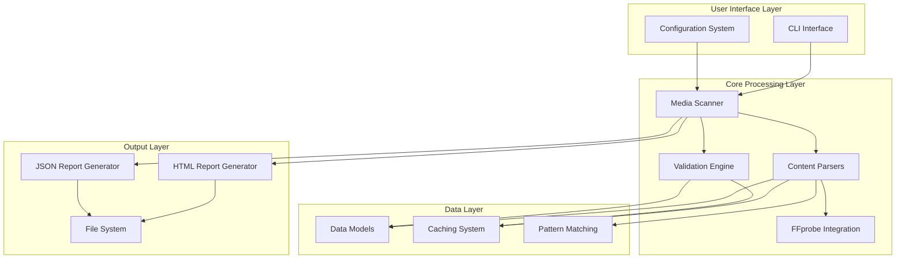
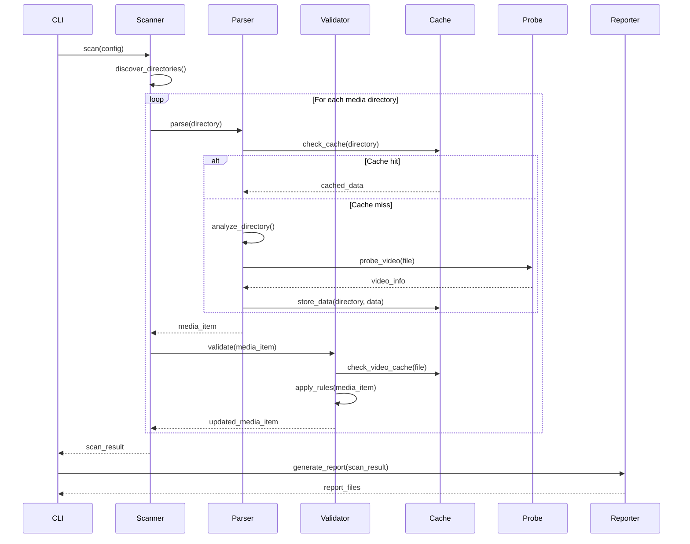
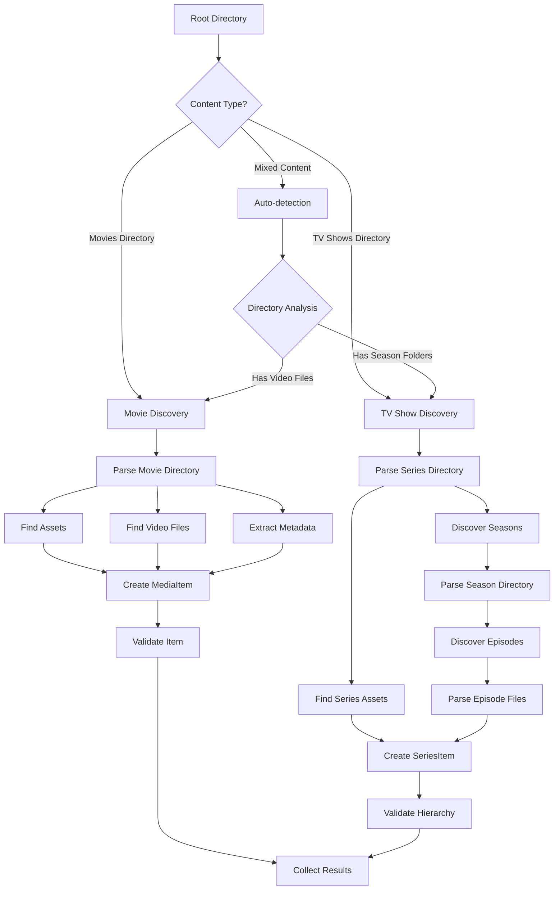
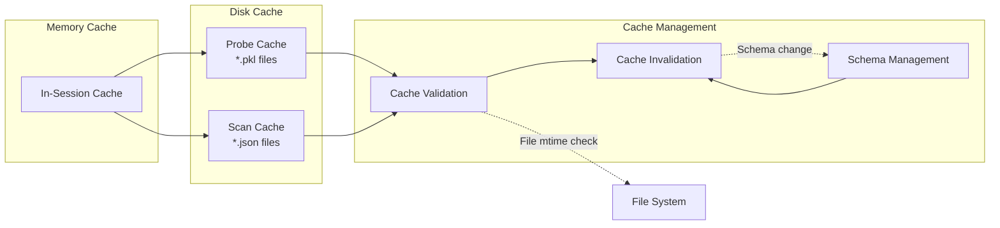

# Architecture Overview

This document provides a comprehensive overview of the Media Audit architecture, including system components, data flow, and design principles.

## System Architecture

Media Audit follows a modular, layered architecture designed for maintainability, extensibility, and performance:



## High-Level Components

### 1. User Interface Layer

#### CLI Interface (`cli.py`)
- **Purpose**: Primary user interaction point
- **Responsibilities**:
  - Command-line argument parsing
  - Configuration loading and validation
  - Progress reporting and user feedback
  - Result processing and display
- **Key Features**:
  - Interactive progress indicators
  - Keyboard interrupt handling (ESC to cancel)
  - Exit code management for automation

#### Configuration System (`config.py`)
- **Purpose**: Centralized configuration management
- **Responsibilities**:
  - YAML configuration file loading
  - Environment variable expansion
  - Configuration validation
  - Default value management
- **Key Features**:
  - Multiple configuration sources
  - Type-safe configuration objects
  - Validation with detailed error messages

### 2. Core Processing Layer

#### Media Scanner (`scanner/scanner.py`)
- **Purpose**: Orchestrates the entire scanning process
- **Responsibilities**:
  - Directory discovery and traversal
  - Concurrent processing coordination
  - Progress tracking and reporting
  - Error handling and collection
- **Key Features**:
  - Multi-threaded processing
  - Cancellation support
  - Memory-efficient scanning
  - Cache integration

#### Content Parsers (`parsers/`)
- **Purpose**: Extract structured information from media directories
- **Components**:
  - `BaseParser`: Abstract foundation class
  - `MovieParser`: Movie-specific parsing logic
  - `TVParser`: TV show parsing with season/episode hierarchy
- **Responsibilities**:
  - Media type detection
  - Metadata extraction from filenames
  - Asset discovery and categorization
  - Video file identification

#### Validation Engine (`validator.py`)
- **Purpose**: Apply quality rules and generate validation issues
- **Responsibilities**:
  - Asset requirement validation
  - Video codec compliance checking
  - Structural validation
  - Issue categorization and severity assignment
- **Key Features**:
  - Configurable validation rules
  - Hierarchical validation (series → seasons → episodes)
  - Performance optimization through caching

#### FFprobe Integration (`probe/`)
- **Purpose**: Video file analysis using FFmpeg's FFprobe
- **Responsibilities**:
  - Video codec detection
  - Resolution and duration extraction
  - Bitrate and file size analysis
  - Technical metadata extraction
- **Key Features**:
  - Subprocess management with timeouts
  - Error handling for corrupted files
  - JSON parsing and data normalization

### 3. Data Layer

#### Data Models (`models.py`)
- **Purpose**: Structured representation of media library data
- **Core Models**:
  - `MediaItem`: Base class for all media content
  - `MovieItem`: Movie-specific data and metadata
  - `SeriesItem`: TV series container
  - `SeasonItem`: Season-level data
  - `EpisodeItem`: Individual episode information
  - `VideoInfo`: Technical video file details
  - `ValidationIssue`: Problem descriptions and metadata
- **Key Features**:
  - Type-safe data structures using dataclasses
  - Automatic property calculations
  - Serialization support

#### Caching System (`cache.py`)
- **Purpose**: Performance optimization through intelligent caching
- **Cache Types**:
  - **FFprobe Cache**: Video analysis results (binary pickle)
  - **Scan Cache**: Parsed media item data (JSON)
  - **Memory Cache**: In-session caching
- **Key Features**:
  - File modification time validation
  - Schema versioning for compatibility
  - Automatic cache invalidation
  - Performance statistics

#### Pattern Matching (`patterns.py`)
- **Purpose**: Media server-specific file pattern recognition
- **Supported Servers**:
  - Plex Media Server
  - Jellyfin
  - Emby
  - Combined patterns
- **Pattern Types**:
  - Poster patterns
  - Background/fanart patterns
  - Banner patterns
  - Trailer patterns
  - Title card patterns
- **Key Features**:
  - Compiled regex patterns for performance
  - Extensible pattern system
  - Multi-server pattern merging

### 4. Output Layer

#### Report Generators (`report/`)
- **HTML Generator** (`html.py`):
  - Interactive HTML reports with embedded CSS/JavaScript
  - Search, filter, and sort functionality
  - Responsive design for multiple screen sizes
  - Thumbnail support with Base64 encoding
  
- **JSON Generator** (`json.py`):
  - Machine-readable structured data
  - Complete scan results serialization
  - Integration-friendly format
  - API compatibility

## Design Principles

### 1. Modularity and Separation of Concerns

Each component has a single, well-defined responsibility:
- **Parsers** only parse and extract data
- **Validators** only validate and generate issues
- **Scanners** only orchestrate the process
- **Reporters** only format and output results

### 2. Extensibility

The architecture supports extension at multiple levels:
- **Custom Parsers**: Inherit from `BaseParser` for new media types
- **Custom Validators**: Extend `MediaValidator` for additional rules
- **Custom Reports**: Implement new output formats
- **Custom Patterns**: Define patterns for new media servers

### 3. Performance Optimization

Multiple strategies ensure good performance:
- **Concurrent Processing**: Multi-threaded file processing
- **Intelligent Caching**: Multiple cache layers with validation
- **Memory Efficiency**: Streaming processing for large libraries
- **Lazy Loading**: Load data only when needed

### 4. Error Resilience

The system gracefully handles various failure scenarios:
- **Individual File Failures**: Continue processing remaining files
- **Missing Dependencies**: Degrade gracefully when FFprobe unavailable
- **Permission Issues**: Skip inaccessible files with warnings
- **Corrupt Data**: Handle malformed files without crashing

### 5. Configuration-Driven Behavior

Most behavior is configurable without code changes:
- **Media Server Profiles**: Select appropriate patterns
- **Validation Rules**: Configure required assets and codecs
- **Performance Settings**: Adjust worker counts and caching
- **Output Options**: Control report generation and formatting

## Data Flow

### Primary Scan Flow



### Directory Processing Flow



### Cache Architecture



## Component Integration

### Parser-Validator Integration

```python
# Parsers create MediaItem objects
movie = MovieParser.parse(directory)

# Validators add issues to existing objects
validator.validate_movie(movie)

# Items now contain both data and validation results
print(f"Movie: {movie.name}")
print(f"Status: {movie.status}")
for issue in movie.issues:
    print(f"Issue: {issue.message}")
```

### Cache Integration Points

```python
# 1. Parser level - parsed media items
cached_movie = cache.get_media_item(directory, "movie")

# 2. Probe level - video analysis results  
cached_probe = cache.get_probe_data(video_file)

# 3. Validator level - uses both caches
validator = MediaValidator(config, cache=cache)
```

### Configuration Integration

```python
# Configuration flows through the system
config = Config.from_file("config.yaml")

# Scanner gets scan configuration
scanner = MediaScanner(config.scan)

# Parsers get patterns from configuration
patterns = config.scan.patterns.compile_patterns()
parser = MovieParser(patterns, cache)

# Validators get rules from configuration
validator = MediaValidator(config.scan, cache)
```

## Scalability Considerations

### Horizontal Scaling

The architecture supports horizontal scaling through:
- **Process-based parallelism**: Multiple process workers
- **Distributed caching**: Shared cache systems (Redis, etc.)
- **Stateless design**: Components don't maintain global state

### Vertical Scaling  

Performance scales with resources through:
- **Configurable worker threads**: Adjust based on CPU cores
- **Memory-efficient processing**: Stream large datasets
- **Intelligent caching**: Reduce redundant work

### Large Library Support

Special considerations for large libraries:
- **Batch processing**: Process items in configurable batches
- **Progress persistence**: Resume interrupted scans
- **Incremental updates**: Only process changed items
- **Memory management**: Garbage collection and cleanup

## Security Architecture

### Input Validation

- **Path traversal protection**: Validate all file paths
- **Configuration validation**: Sanitize user-provided configuration
- **Command injection prevention**: Safe subprocess execution

### File System Access

- **Permission handling**: Graceful handling of access denied
- **Symlink handling**: Safe traversal of symbolic links
- **Resource limits**: Prevent excessive disk/memory usage

### Cache Security

- **Cache isolation**: Per-user cache directories
- **Data integrity**: Validate cached data before use
- **Cleanup procedures**: Remove stale cache entries

## Extension Points

### Custom Media Types

```python
# Extend BaseParser for new content types
class AnimeParser(BaseParser):
    def parse(self, directory: Path) -> MediaItem:
        # Custom anime parsing logic
        pass

# Register with scanner
scanner.register_parser("anime", AnimeParser)
```

### Custom Validation Rules

```python
# Extend MediaValidator
class CustomValidator(MediaValidator):
    def validate_movie(self, movie: MovieItem) -> None:
        super().validate_movie(movie)
        # Additional custom validations
        self._validate_custom_rules(movie)
```

### Custom Report Formats

```python
# Implement new report generator
class CustomReportGenerator:
    def generate(self, scan_result: ScanResult, output_path: Path) -> None:
        # Custom report generation logic
        pass
```

### Plugin Architecture

```python
# Plugin interface
class MediaAuditPlugin:
    def register_parsers(self) -> dict[str, type[BaseParser]]:
        pass
    
    def register_validators(self) -> dict[str, type[MediaValidator]]:
        pass
    
    def register_reporters(self) -> dict[str, type[ReportGenerator]]:
        pass
```

## Development Workflow

### Adding New Features

1. **Model Changes**: Update data models if new fields needed
2. **Parser Updates**: Modify parsers to extract new information
3. **Validation Rules**: Add validation logic for new requirements
4. **Report Updates**: Update report templates to show new data
5. **Configuration**: Add configuration options if needed
6. **Tests**: Add comprehensive tests for new functionality

### Performance Optimization

1. **Profiling**: Use profilers to identify bottlenecks
2. **Caching**: Add caching for expensive operations
3. **Concurrency**: Increase parallelism where safe
4. **Algorithms**: Optimize data structures and algorithms
5. **Memory**: Reduce memory usage through streaming

### Debugging and Monitoring

1. **Logging**: Structured logging at appropriate levels
2. **Metrics**: Performance and health metrics collection
3. **Error Tracking**: Comprehensive error reporting
4. **Tracing**: Request/operation tracing for debugging

## Future Architecture Considerations

### Microservices Architecture

Potential split into microservices:
- **Scanning Service**: Directory traversal and parsing
- **Validation Service**: Rule engine and validation
- **Analysis Service**: Video probing and metadata extraction
- **Reporting Service**: Report generation and distribution

### Event-Driven Architecture

Potential event-driven improvements:
- **Scan Events**: Real-time progress updates
- **Validation Events**: Immediate issue notifications
- **File System Events**: Watch for changes and incremental updates

### API Integration

RESTful API for programmatic access:
- **Scan Endpoints**: Trigger scans via HTTP
- **Status Endpoints**: Query scan progress and results
- **Configuration Endpoints**: Manage configuration remotely
- **WebSocket Support**: Real-time updates and progress

This architecture provides a solid foundation for the Media Audit system while maintaining flexibility for future enhancements and customizations.